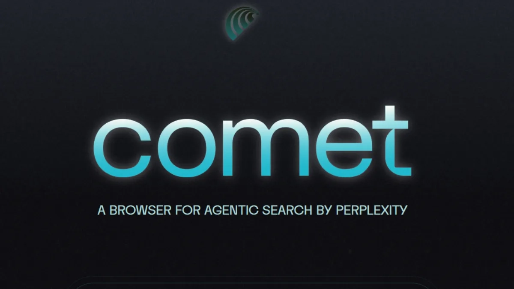

# Perplexity Comet浏览器即将登陆Windows：一款能帮你砍价的AI浏览器

---

你有没有想过，浏览器除了打开网页，还能帮你找优惠券、筛选未读邮件，甚至让你"试穿"衣服？Perplexity的Comet AI浏览器正在做这些事。三个月前它只对macOS用户开放测试，现在Windows、Android和iOS用户也能排队体验了。如果你厌倦了传统浏览器的"傻瓜式"操作，这篇文章会告诉你怎么抢先用上这款会"主动干活"的浏览器。

---

## Comet浏览器要来Windows了，CEO亲口确认

Perplexity的CEO Aravind Srinivas在推特上发了条消息：Windows版本已经准备好了，部分早期测试用户已经收到邀请。他还透露，Android版本的开发进度"快得离谱"，比原计划提前了不少。iOS版本也在路上。

这意味着什么？如果你是Windows用户，可能很快就能用上这款浏览器。如果你用安卓或苹果手机，等待时间也不会太久。

## 怎么加入等候名单？

操作很简单：

1. 打开Perplexity的[官方页面](https://www.perplexity.ai/comet)
2. 输入你的邮箱地址
3. 等通知

就这么简单。没有复杂的申请流程，也不需要填一堆问卷。输入邮箱，然后该干嘛干嘛去。等浏览器开始推送时，你会收到邮件。

## Comet到底能干什么？

目前Comet只对使用苹果M系列芯片的macOS用户开放测试。它最大的特点是"Agentic AI"功能——简单说，就是浏览器会主动帮你做事。

**它能做这些：**

- **购物车优化**：检查你的购物车，自动找最优惠的折扣
- **邮件筛选**：帮你找出未读邮件，不用自己翻
- **虚拟试衣**：上传你的照片，预览衣服穿在你身上的效果

这些功能听起来有点像私人助理。你不需要手动搜索优惠码，也不用一封封翻邮件。浏览器会主动告诉你："嘿，这件商品有更便宜的渠道"或者"你有三封重要邮件没看"。

👉 [想了解更多AI如何改变浏览体验？点这里看看Perplexity的其他功能](https://pplx.ai/ixkwood69619635)

## 争议：它会收集你的数据吗?

Comet还没正式发布,就已经引发了争议。CEO Aravind Srinivas在一次采访中说,Perplexity会利用浏览器"获取应用外的数据,以便更好地了解你"。

这话一出,很多人开始担心隐私问题。不过他后来补充说明:用户可以选择退出定向广告个性化功能。换句话说,你可以关掉这个功能,但默认情况下它可能是开启的。

这种做法在科技圈并不罕见。很多浏览器和应用都会收集用户数据来优化体验或推送广告。关键在于,Perplexity是否会给用户足够清晰的控制权。

## 竞争对手不少,Comet能脱颖而出吗?

AI浏览器这个赛道已经挤满了玩家。Opera推出了Neon浏览器,OpenAI也有自己的Operator工具。Comet想要突围,光靠"会帮你找优惠券"可能还不够。

**它的优势在哪？**

- **Perplexity的AI搜索能力**：Perplexity本身就是一个强大的AI搜索引擎,把这个能力整合到浏览器里,理论上会比其他竞品更懂你的需求
- **跨平台支持**：Windows、macOS、Android、iOS全覆盖,用户不用担心换设备后没法用
- **主动式AI**：不是等你问问题,而是主动发现问题并解决

但劣势也很明显:隐私争议、尚未正式发布、功能稳定性未知。这些都是Comet需要面对的挑战。

## 值得期待吗?

如果你是那种喜欢尝鲜的人,Comet值得一试。它的"主动AI"功能确实有点意思,尤其是购物优化和邮件筛选,能省不少时间。

但如果你对隐私特别敏感,可能需要等正式版发布后,看看Perplexity会提供哪些隐私控制选项。毕竟,一个会"主动了解你"的浏览器,听起来既方便又有点让人不安。

目前没有确切的发布日期,但从CEO的推特来看,Windows和Android版本应该不会让人等太久。iOS用户可能需要再耐心一点。

---

## 总结

Perplexity的Comet浏览器正在从macOS扩展到Windows、Android和iOS平台。它的核心卖点是"会主动干活的AI"——帮你找折扣、筛邮件、试衣服。虽然隐私争议还没完全解决,但如果你想体验一款真正"聪明"的浏览器,👉 [现在就去官网排队,说不定你就是第一批用户](https://pplx.ai/ixkwood69619635)。
